## Deep Learning and Bitcoins [[view code]](http://nbviewer.jupyter.org/github/marcotav/deep-learning/blob/master/bitcoin/notebooks/deep-learning-LSTM-bitcoins.ipynb) 
  

**For the best viewing experience use [nbviewer](http://nbviewer.jupyter.org/github/marcotav/deep-learning/blob/master/bitcoin/notebooks/deep-learning-LSTM-bitcoins.ipynb).**


<p align="center">
  
</p>                                                                  
<p align="center">
  <a href="#pre">Preamble </a> •
  <a href="#intro">Goal </a> •
  <a href="#imp">Importing libraries </a> •
  <a href="#data">Data </a> •
  <a href="#dw">  Data Wrangling </a> •
  <a href="#tts">  Train/Test split </a> •
  <a href="#lstm"> Building LSTM </a> •
  <a href="#ttl"> Train and test loss </a> •
  <a href="#ptv"> Predicted and True Values </a> •
  <a href="#alt"> Altcoins </a> •
  <a href="#bev"> Bird's eye view of the underlying mathematics </a> •
  <a href="#td"> To Dos </a>
</p>

<a id = 'pre'></a>
## Preamble

There are several important questions about cryptocurrency speculation that haven't been completely understood yet. A few examples are:
- What are the causes of the gigantic spikes and dips?
- Are the dynamics of different altcoins related? 
- Is it possible to predict future prices?

<a id = 'intro'></a>
## Goal

My goal here is to build predictive models for the price of Bitcoins and other cryptocurrencies. To accomplish that, I will use Long Short-Term Memory recurrent neural networks (LSTMs). For a thorough introduction to Bitcoins you can check this [book](https://github.com/bitcoinbook/bitcoinbook). For LSTM [this](http://colah.github.io/posts/2015-08-Understanding-LSTMs/) is a good source.

<a id = 'imp'></a>
## Importing libraries

Let us now import the necessary libraries. 

```
import numpy as np
import pandas as pd
import statsmodels.api as sm
import aux_func as af 
from scipy import stats
import keras
import pickle
import quandl
from keras.models import Sequential
from keras.layers import Activation, Dense,LSTM,Dropout
from sklearn.metrics import mean_squared_error
from math import sqrt
from random import randint
from keras import initializers
import datetime
from datetime import datetime
from matplotlib import pyplot as plt
%matplotlib inline

from IPython.core.interactiveshell import InteractiveShell
InteractiveShell.ast_node_interactivity = "all" # see the value of multiple statements at once.
pd.set_option('display.max_columns', None)
```

<a id = 'data'></a>
## Data

There are several ways to fetch historical data for Bitcoins (or any other cryptocurrency). Here are a few examples:

####  Flat files
If a flat file already available, we can just read it using `pandas`. For example, one of the datasets that will be used in this notebook can be found [here](https://www.kaggle.com/mczielinski/bitcoin-historical-data/data). In this case we simply use:
```
df = pd.read_csv('bitcoin_data.csv')
```

<p align="center">
  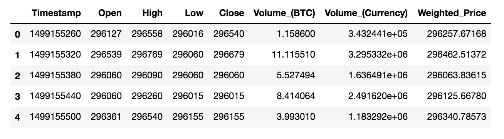>
</p> 

<p align="center">
  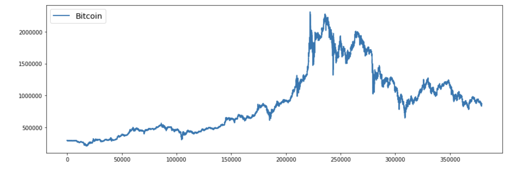>
</p>

####  Retrieve Data from Quandl's API
Another possibility is to retrieve Bitcoin pricing data using [Quandl's free Bitcoin API]((https://blog.quandl.com/api-for-bitcoin-data)). For example, to obtain the daily bitcoin exchange rate (BTC vs. USD) on Bitstamp we use the code snippet below. The function `quandl_data` is inside the library `af`. Here we use:
```
df_qdl = af.quandl_data(quandl_id)
```
where e.g.
```
quandl_id = 'BCHARTS/BITSTAMPUSD'
```
<p align="center">
  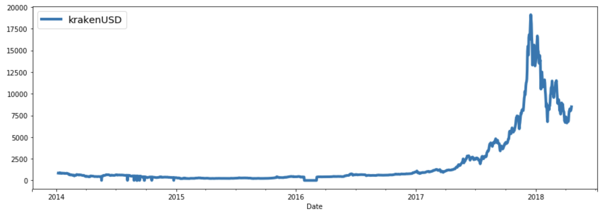>
</p> 

#### Retrieve Data from cryptocompare.com
Another possibility is to retrieve data from [cryptocompare](https://www.cryptocompare.com/). In this case, we use the `requests` packages to make a `.get` request (the object `res` is a `Response` object) such as:

    res = requests.get(URL)


<p align="center">
  >
</p> 

<p align="center">
  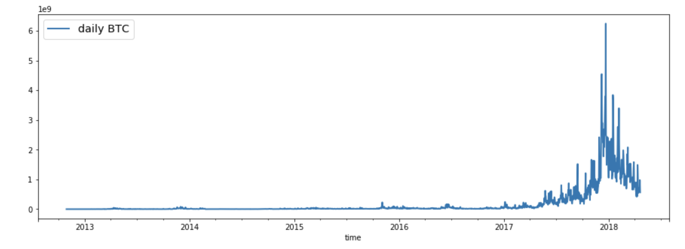>
</p> 


<a id = 'dw'></a>
## Data Wrangling

### Converting dates to daily means:
Though Timestamps are in Unix time, this is easily taken care of using Python's `datetime` library:
- `pd.to_datetime` converts the argument to `datetime` 
- `Series.dt.date` gives a numpy array of Python `datetime.date` objects

We then drop the `Timestamp` column. The repeated dates occur simply because the data is collected minute-to-minute. Taking the daily mean:
```
af.daily_weighted_prices(df,'date','timestamp','s').head()
```
<a id = 'tts'></a>
## Train/Test split
We now need to split our dataset. We need to fit the model using the training data and test the model with the test data. We must choose the proportion of rows that will constitute the training set.
```
train_size = 0.80
training_rows = train_size*len(daily)
train = daily[:int(training_rows)]  
test = daily[int(training_rows):] 
```
We can automatize the split using a simple function for the library `aux_func`:
```
train = af.train_test_split(daily, test_size=0.2)[0]
test = af.train_test_split(daily, test_size=0.2)[1]
```
We can check for trends, seasonality and residue in the data using `Scipy`. Joining train and test sets and using the functions `trend`, `seasonal`, `residue` and `plot_components` for `af`:
```
dataset = pd.concat([train, test]).reset_index()
dataset['date'] = pd.to_datetime(dataset['date'])
dataset = dataset.set_index('date')

af.plot_comp(af.trend(dataset,'weighted_price'),
          af.seasonal(dataset,'weighted_price'),
          af.residue(dataset,'weighted_price'),
          af.actual(dataset,'weighted_price'))              
```

<p align="center">
  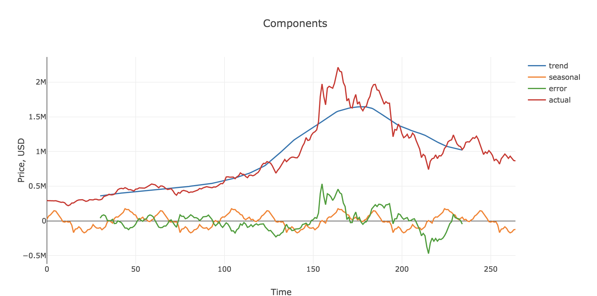
</p> 

To run the LSTM in Keras we must reshape out datasets:
```
train = np.reshape(train, (len(train), 1))
test = np.reshape(test, (len(test), 1))
```
We also use `MinMaxScaler` to scale and translate features to a given range (between zero and one). 
```
from sklearn.preprocessing import MinMaxScaler
scaler = MinMaxScaler()
train = scaler.fit_transform(train)
test = scaler.transform(test)
```
After that we reshape once more:
```
X_train, Y_train = af.lb(train, 1)
X_test, Y_test = af.lb(test, 1)
X_train = np.reshape(X_train, (len(X_train), 1, X_train.shape[1]))
X_test = np.reshape(X_test, (len(X_test), 1, X_test.shape[1]))
```
The function `lb` "looks back" defining a window of past values that will be used as predictors for
future values.

<a id = 'lstm'></a>
## Building LSTMs

### Overview of Recurrent Neural Networks (RNN)

Recurrent Neural Networks (RNN) are designed to handle sequential inputs (in contrast to multilayer perceptrons or convolutional neural nets). When an input is fed into the network, the weights matrix of the hidden layer from the *previous* input is also supplied concomitantly. Since the weights of the hidden layer have essentially "captured" information about the past, the RNN can be said to have "memory." In other words, the output of the network is influenced not just by the input just fed into it, but also by the full history of past inputs. The figure below, borrowed from [here](http://colah.github.io/posts/2015-08-Understanding-LSTMs/) makes these clearer:

<p align="center">
  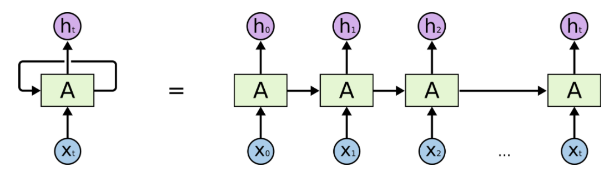>
</p>

Following [Karpathy](http://karpathy.github.io/2015/05/21/rnn-effectiveness/), we can write a RNN as the class below:
```
class RNN:
  def step(self, x):
    self.h = np.tanh(np.dot(self.W_hh, self.h) + np.dot(self.W_xh, x))
    y = np.dot(self.W_hy, self.h)
    return y
```
and
```
rnn = RNN()
y = rnn.step(x)
```
Inside the class, the first line updates the hidden state and the following line computes the output. In the instantiation below, `x` is the input vector and `y` is the output. The three matrices `W_hh`, `W_xh`, `W_hy` are the RNN parameters. For more details see [Karpathy](http://karpathy.github.io/2015/05/21/rnn-effectiveness/).


### LSTM networks

LSTM networks are a type of RNN that is specially handy because they allow large networks to be trained successfully by avoiding problems with vanishing gradients and exploding gradients during backprop.

<p align="center">
  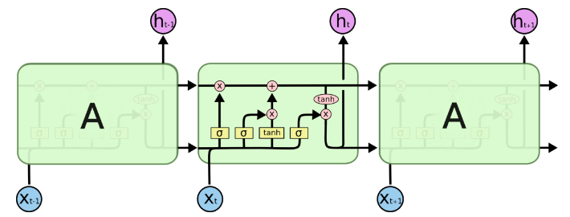>
</p>  


### LSTMs in action

Building, compiling and fitting the network:
```
model = Sequential()
model.add(LSTM(256, return_sequences=True, input_shape=(X_train.shape[1], X_train.shape[2])))
model.add(LSTM(256))
model.add(Dense(1))
model.compile(loss='mean_squared_error', optimizer='adam')
history = model.fit(X_train, Y_train, epochs=200, batch_size=32, 
                    validation_data=(X_test, Y_test))
```

<p align="center">
  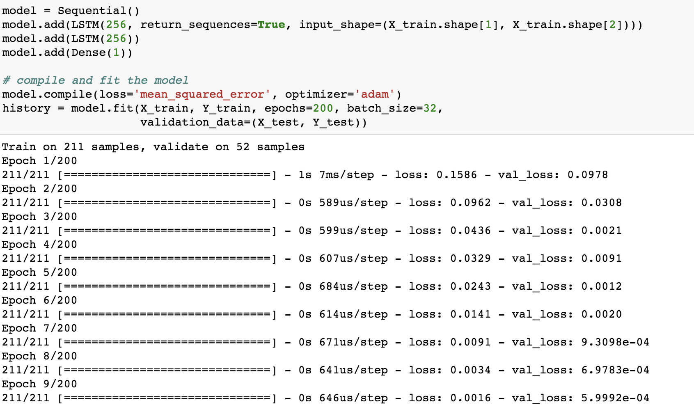>
</p>

The topology of the network is quite simple (by choice):

<p align="center">
  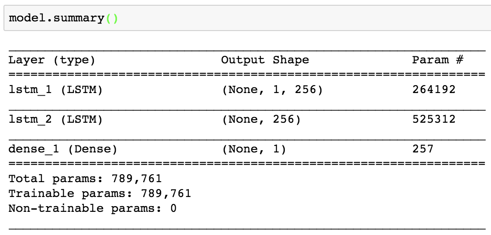>
</p> 


<a id = 'ttl'></a>
## Train and test loss

While the model is being trained, the train and test losses vary as shown in the figure below. The package `plotly.graph_objs` is extremely useful. The function `t( )` inside the argument is defined in `aux_func`:

<p align="center">
  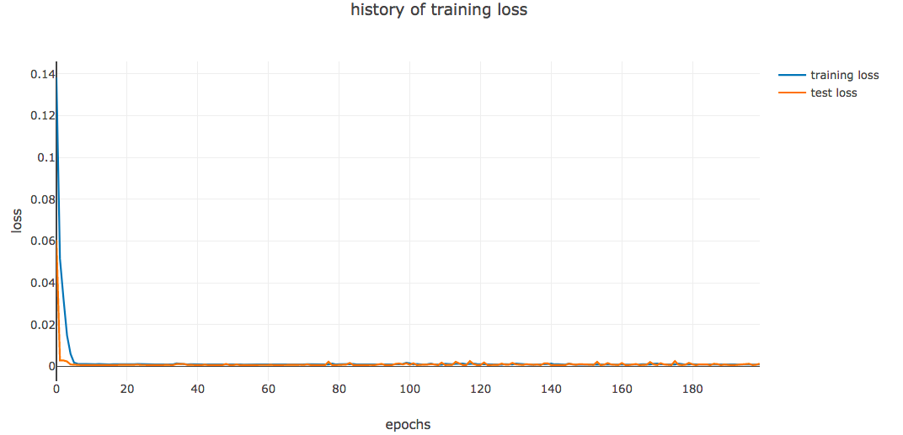
</p>  

<a id = 'ptv'></a>
## Predicted and True Values

The predicted and true values are shown below. The RMSE is too high which can be understood just by glancing at the curve. The function `t( )` inside the argument is defined in the `aux_func` library.

```
layout = dict(title = 'True prices vs predicted prices',
             xaxis = dict(title = 'Day'), yaxis = dict(title = 'USD'))
fig = dict(data=[af.prediction_vs_true(Y_test_new_inv,'Prediction'),af.prediction_vs_true(pred_inv_new,'True')],
           layout=layout)
py.iplot(fig, filename='results')
```


<p align="center">
  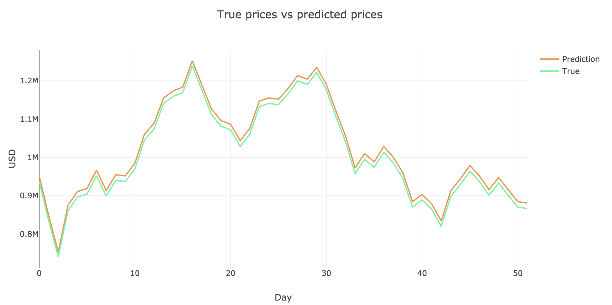
</p> 

Repeating the analysis for price variations:

```
df = pd.DataFrame(data={'prediction':  y_predict.tolist(), 'testing': y_testing})

pct_variation = df.pct_change()[1:]
pct_variation = pct_variation[1:]

layout = dict(title = 'True prices vs predicted prices variation (%)',
             xaxis = dict(title = 'Day'), yaxis = dict(title = 'USD'))
fig = dict(data=[af.prediction_vs_true(pct_variation['prediction'],'Prediction')
                 ,af.prediction_vs_true(pct_variation['testing'],'True')],
           layout=layout)
py.iplot(fig, filename='results')
```

<p align="center">
  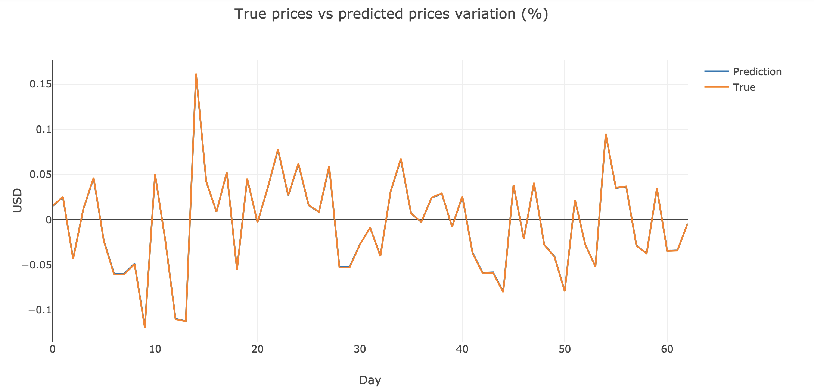
</p> 

<a id = 'alt'></a>
## Altcoins

Using the Poloniex API and two auxiliar function ([Ref.1](https://blog.patricktriest.com/analyzing-cryptocurrencies-python/)). The URL from Poloniex we need, which I call `poloniex`, is [here]('https://poloniex.com/public?command=returnChartData&currencyPair={}&start={}&end={}&period={}') Choosing the value of the end date to be today we have:

```
start = datetime.strptime('2015-01-01', '%Y-%m-%d') # get data from the start of 2015
end = datetime.now() 
period = 86400 # day in seconds
```
```
def get_crypto_data(poloniex_pair):
    data_df = af.get_json_data(poloniex.format(poloniex_pair, 
                                               start.timestamp(),
                                               end.timestamp(), 
                                               period),
                            poloniex_pair)
    data_df = data_df.set_index('date')
    return data_df

lst_ac = ['ETH','LTC','XRP','ETC','STR','DASH','SC','XMR','XEM']
len(lst_ac)
ac_data = {}
for a in lst_ac:
    ac_data[a] = get_crypto_data('BTC_{}'.format(a))
```

<a id = 'bev'></a>
## Bird's eye view of the underlying mathematics
In preparation.

<a id = 'td'></a>
## To Dos

- [ ] Build portfolio of cryptocurrencies
- [ ] Tweak layers of network to improve RMSE
- [ ] Use other machine learning algorithms (to make inferences and not just predictions)
- [ ] Include other predictors
- [ ] Decrease RMSE
- [ ] Use GRU
- [ ] Explain LSTM in more detail
- [ ] Include pdf with mathematics in the repo
- [ ] Eliminate stationarity and repeat analysis
- [ ] Use `statsmodels` to obtain results of tests such as DF
