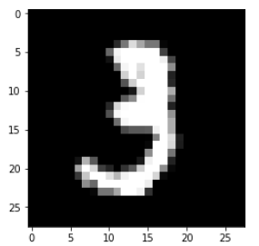
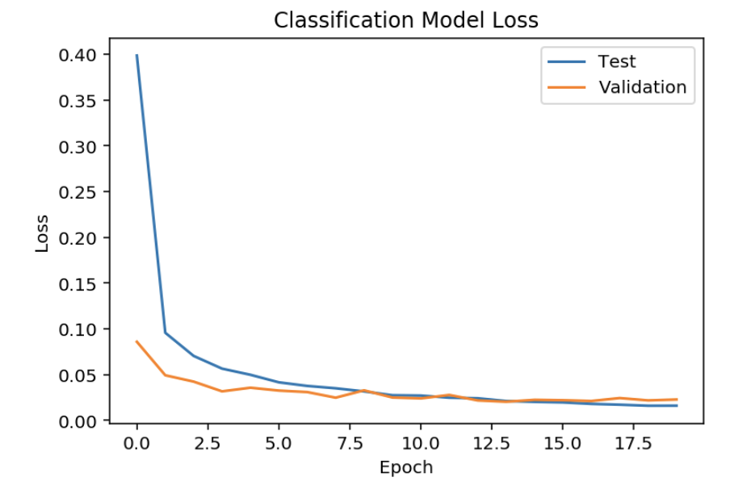
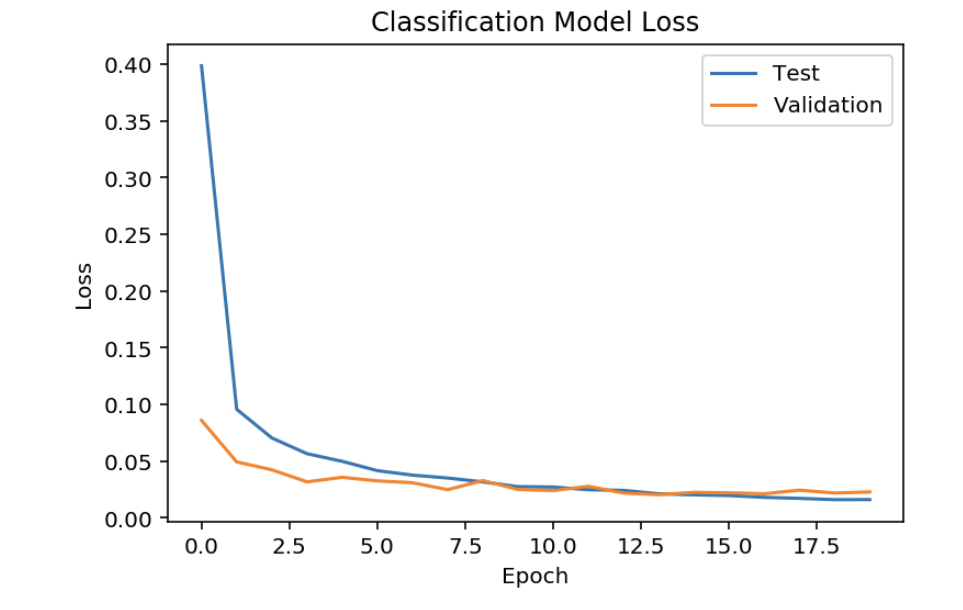
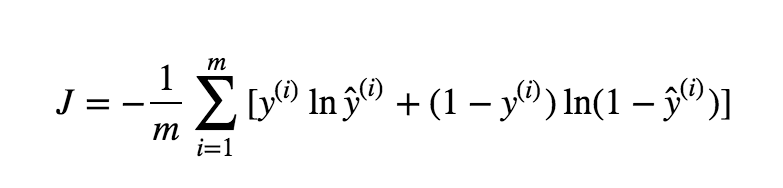

## Digit Recognition with Tensorflow and Keras [[view code]](http://nbviewer.jupyter.org/github/marcotav/deep-learning/blob/master/keras-tf-tutorial/notebooks/neural-nets-digits-mnist.ipynb)
      

**The code is available [here](http://nbviewer.jupyter.org/github/marcotav/deep-learning/blob/master/keras-tf-tutorial/notebooks/neural-nets-digits-mnist.ipynb) or by clicking on the.**


<br>
<p align="center">
  
</p>
<br>

<p align="center">
  <a href="#intro"> Introduction </a> •
  <a href="#steps"> Steps </a> •
  <a href="#mnist">  Loading MNIST dataset </a> •
  <a href="#kerascnn">  Keras Convolutional Network </a> •
  <a href="#tf"> TensorFlow fully-connected network </a> 
</p>


<a id = 'intro'></a>
## Introduction

The MNIST dataset contains 70,000 images of digits taken from several scanned documents (normalized in size and centered). Each image is seen by the computer as an array of $28\times 28$ pixels squared. Each of these numbers is given a value from inside $[0,255]$, describing the pixel intensity at that point. Giving the computer this array of numbers, it will output numbers describing the probability of the image pertaining to a given class.

In this notebook I will build and train two types of neural network using the MNIST set, namely:
- A fully-connected neural network using `TensorFlow`
- A `Keras` convolutional network


<a id = 'steps'></a>
## Steps

- We first load the data
- Then we split the feature matrix `X` and the target vector `y` into `train` and `test` subsets.
- This is followed by data preprocessing where:
  - `X` is normalized, dividing each pixel value by the maximum value of a pixel (255)
  - Since this is a multi-class classification problem, `Keras` needs `y` to be a one-hot encoded matrix
- Create the neural network:
 - A `Keras` convolutional network
 - A `TensorFlow` fully-connected network
- Since we have multi-class classification we will use a `softmax` activation function on the output layer.
- Regularization and dropout can be used to improve performance.
-  We then train the network.
-  After training, we make predictions (numbers in the range 0-9).

<a id = 'imp'></a>
## Imports

```
import numpy as np
import pandas as pd
from keras.datasets import mnist
from keras.models import Sequential
from keras.layers import Dense
from keras.layers import Dropout
from keras.layers import Flatten
from keras.layers.convolutional import Conv2D
from keras.layers.convolutional import MaxPooling2D
from keras.utils import np_utils
from keras import backend as K
K.set_image_dim_ordering('th')
import matplotlib.pyplot as plt
%matplotlib inline
seed = 42
np.random.seed(seed)
from IPython.core.interactiveshell import InteractiveShell
InteractiveShell.ast_node_interactivity = "all" # see the value of multiple statements at once.
```
<a id = 'mnist'></a>
## Loading MNIST dataset

Loading the MNIST and looking at an image:
```
(X_train, y_train), (X_test, y_test) = mnist.load_data()
plt.imshow(X_train[10],cmap = plt.get_cmap('gray'))
plt.show()
```
<p align="center">
  
</p>
<br>

Now we transforming `y` into a one-hot encoded matrix and normalize:

```
X_train = X_train.reshape(X_train.shape[0], 1, 28, 28).astype('float32')
X_test = X_test.reshape(X_test.shape[0], 1, 28, 28).astype('float32')

X_train.shape

X_train = X_train/255
X_test = X_test/255
y_train = np_utils.to_categorical(y_train)
y_test = np_utils.to_categorical(y_test)
```
<a id = 'kerascnn'></a>
## `Keras` Convolutional Network

Roughly speaking, convolutional neural networks (CNN) start from pixels, then get to edges, then corners, until a digit is obtained. Let uis first build a small CNN and then a larger one:

### Building a small CNN:


The function `cnn_model` below builds the following CNN:

- We have a convolutional layer with 30 feature maps of size 5 $\times$ 5.

        model.add(Conv2D(32, (5, 5), input_shape=(1, 28, 28), activation ='relu'))
        
- Then we have a pooling layer which takes the maximum over 2 $\times$ 2 patches.
- A Dropout layer with a probability of 20$%$.
- Then a `Flatten` layer is included
- Then we have a fully connected layer containing 128 neurons and a `reLU` activation. 
- Output layer.

```
num_classes = 10
def cnn_model():
    model = Sequential()
    model.add(Conv2D(32, (5, 5), input_shape=(1, 28, 28), activation = 'relu'))
    model.add(MaxPooling2D(pool_size=(2, 2)))
    model.add(Dropout(0.2))
    model.add(Flatten())
    model.add(Dense(128, activation = 'relu'))
    model.add(Dense(num_classes, activation = 'softmax'))
    model.compile(loss='categorical_crossentropy', optimizer='adam', metrics=['accuracy'])
    return model
```
```
small_model = cnn_model()
history = small_model.fit(X_train, y_train, validation_data=(X_test, y_test), epochs=20, batch_size=200,verbose=2)
scores = small_model.evaluate(X_test, y_test, verbose=2)
print("CNN Error: %.2f%%" % (100-scores[1]*100))
```
```
train_loss_small = history.history['loss']
test_loss_small = history.history['val_loss']
```
<p align="center">
  
</p>
<br>

### Building a larger CNN:

Let us build Another function `large_cnn_model`. The topology now is:

- A convolutional layer with 30 feature maps of size 5 $\times$ 5.

        model.add(Conv2D(30, (5, 5), input_shape=(1, 28, 28), activation = activation_1))
        
- Then we have a pooling layer which takes the maximum over 2 $\times$ 2 patches.
- Then a convolutional layer with 15 feature maps of size 3 × 3 is included.
- The next steps is to include a pooling layer takes the maximum over 2 $\times$ 2 patches.
- A Dropout layer with a probability of 20$%$.
- Then a flatten layer is included
- Then we have a fully connected layer containing 128 neurons and a `reLU` activation. 
- Finally we hve a fully connected layer with 50 neurons and `reLU` activation.
- Output layer.

The following function builds the CNN:
```
def cnn_model_large():
    model = Sequential()
    model.add(Conv2D(30, (5, 5), input_shape=(1, 28, 28), activation='relu')) 
    model.add(MaxPooling2D(pool_size=(2, 2)))
    model.add(Conv2D(15, (3, 3), activation='relu'))
    model.add(MaxPooling2D(pool_size=(2, 2)))
    model.add(Dropout(0.2))
    model.add(Flatten())
    model.add(Dense(128, activation='relu'))
    model.add(Dense(50, activation='relu'))
    model.add(Dense(num_classes, activation='softmax'))
    model.compile(loss='categorical_crossentropy', optimizer='adam', metrics=['accuracy']) 
    return model
```
```
large_model = cnn_model_large()
large_history = large_model.fit(X_train, y_train, validation_data=(X_test, y_test),
                                epochs=20, batch_size=200,verbose=2)
large_scores = large_model.evaluate(X_test, y_test, verbose=2)
print("CNN Error: %.2f%%" % (100-large_scores[1]*100))
```
```
train_loss_large = large_history.large_history['loss']
test_loss_large = large_history.large_history['val_loss']
```
<p align="center">
  
</p>
<br>

<a id = 'tf'></a>
## `TensorFlow` fully-connected network

### A few other packages are needed
```
import tensorflow as tf
from tensorflow.examples.tutorials.mnist import input_data
mnist = input_data.read_data_sets('MNIST_data', one_hot=True)`
import random
```

### Defining our session and initializing variables

The session is just a flow chart. The variables will be inputed later on.

```
sess = tf.Session()
init = tf.initialize_all_variables()
sess.run(init)
```

### Placeholders

- `TensorFlow` uses placeholders which are variables into which data is fed. 
- Using the optional argument `None` allows for feeding any number of inputs of size 784 (for `x`) or 10 (for `y`).

```
x = tf.placeholder(tf.float32, shape=[None, 784])
y_ = tf.placeholder(tf.float32, shape=[None, 10])
```

### Weights and bias

The weight matrix and bias vectors are introduced as below. The dimensions of W and b are respectively, 784 x 10 and b is a vector of 10 components.
```
W = tf.Variable(tf.zeros([784,10]))
b = tf.Variable(tf.zeros([10]))
```
### Activation function and loss function

- We use the `softmax` as our activation 
- The loss function is the cross-entropy:

<p align="center">
  
</p>
<br>

where the m is the number of the training examples and the predictions are the "hatted" variables.

```
y = tf.nn.softmax(tf.matmul(x,W) + b)
cross_entropy = tf.reduce_mean(-tf.reduce_sum(y_ * tf.log(y), reduction_indices=[1]))
```

### Training using gradient descent

- We need to define the training method (GD) and variables for determining the accuracy.

```
learning_rate = 0.05
training = tf.train.GradientDescentOptimizer(learning_rate).minimize(cross_entropy)
prediction = tf.equal(tf.argmax(y,1), tf.argmax(y_,1))
acc = tf.reduce_mean(tf.cast(prediction, tf.float32))
```
```
training_steps = 200
for i in range(training_steps+1):
    sess.run(training, feed_dict={x: X_train, y_: y_train})
    if i%100 == 0:
        print('Training Step:' + str(i) + '  Accuracy =  ' 
              + str(sess.run(acc, feed_dict={x: X_test, y_: y_test})) 
              + '  Loss = ' + str(sess.run(cross_entropy, {x: X_train, y_: y_train})))
sess.run(y, feed_dict={x: X_train})
```
```
def display_compare(num):
    X_train, y_train = mnist.train.images[num,:].reshape(1,784),mnist.train.labels[num,:]
    label = y_train.argmax()  
    plt.title('Prediction: %d Label: %d' % (sess.run(y, feed_dict={x: X_train}).argmax() , label))
    plt.imshow(X_train.reshape([28,28]))
    plt.show()
```
```
for i in range(0,10):
    display_compare(i)
```

## To be continued
