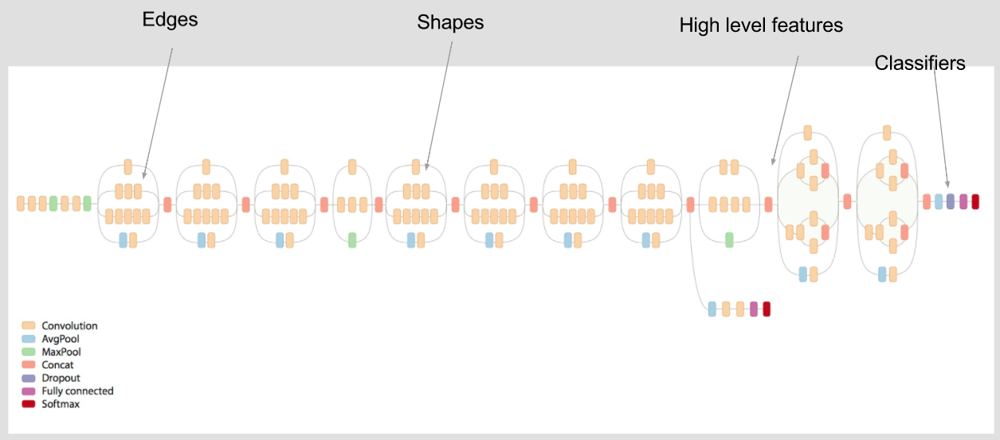
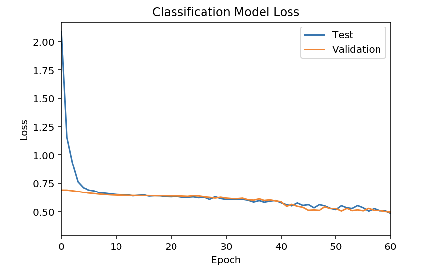

## Painter Identification with Convolutional Neural Nets [[view code]](http://nbviewer.jupyter.org/github/marcotav/deep-learning/blob/master/painters-identification/notebooks/capstone-models-final-model-building.ipynb) 
  

**The code is available [here](http://nbviewer.jupyter.org/github/marcotav/deep-learning/blob/master/painters-identification/notebooks/capstone-models-final-model-building.ipynb) or by clicking on the [view code] link above.**

<br>
<br>
<p align="center">
  
</p>
<br>

<p align="center">
  <a href="#goal"> Goal </a> •
  <a href="#chal"> Challenges and Applications </a> •
  <a href="#over"> Overview and Data </a> •
  <a href="#orgdata"> Preprocessing the data </a> •
  <a href="#Small datasets"> Problems with small datasets </a> •
  <a href="#bn"> Using bottleneck features of Inception V3 </a> •
  <a href="#InceptionV3"> Creating and training using the InceptionV3 model </a> •
  <a href="#trainfully"> Training the fully-connected network</a> •
  <a href="#plots"> Plotting the accuracy and loss histories </a> •
  <a href="#Conclusions">Conclusions</a> •
  <a href="#td">To Dos</a> 
</p>

<a id = 'goal'></a>
## Goal

The goal of this project is to use Transfer Learning to build a Convolutional Neural Network (or ConvNet) to identify the artist of a given painting. 
<a id = 'chal'></a>
## Challenges and Applications
There are several challenges inherent to this problem. Examples are:
- Painters change styles along their career (many times drastically). Both paintings below are from Pablo Picasso but from different phases of his career.
<br>
<br>
<p align="center">
  
</p>
<br>
- The task involves more than just object recognition or face recognition, since painters can paint many different types of objects.

However, using high-performance image recognition techniques for this task can have some distinctive advantages:
- It is a non-invasive procedure, in contrast to several methods currently used by art specialists
- It can be used for forgery identification possibly with better accuracy compared with current techniques

<a id = 'over'></a>
## Overview and Data
The data was compiled by [Kaggle](https://www.kaggle.com/c/painter-by-numbers) (based on WikiArt.org datasets) and consisted in approximately 100,000 paintings by more than 2,000 painters. To prevent sampling size problems with the training set, I restricted the dataset by setting a threshold for the minimum number of paintings per artist. I varied this threshold and evaluated the appropriate metrics for each case. As a warm-up, I started with only three painters and increased the number of painters up to 37 (which was the number of painters with 400 or more paintings in the data). 

I used `Keras` to build a fully-connected neural network based on Google's deep learning model `Inception V3` using Transfer Learning. In Transfer Learning, knowledge obtained training using one type of data is used to train another type of data.

First, a few comments about the dataset:
- The file `all_data_info.csv` (downloaded from [Kaggle](https://www.kaggle.com/c/painter-by-numbers)) contains information about the paintings (such as artist, genre, filename of the associated image and so on). From this `csv` file, I built a Pandas `DataFrame` where each row corresponds to one image. Three columns of the`DataFrame` were useful in the analysis, namely, `artist` (the name of the artist), `in_train` (a Boolean variable identifying the presence or absence of that painting in the training set) and `new_filename` (the name of the files corresponding to the paintings). 

<br>
<br>
<p align="center">
  
</p>
<br>

- To keep only artists with threshold `minimum` I wrote a simple function `threshold( )`, which is contained in the file `aux_func.py`, which is also in this repo. The functions takes three arguments. The list of artists can be built from the indexes of the `.value_counts()` Pandas `Series`. These steps are shown in the code snippet below.
- In addition to the usual Python libraries (`Pandas`, `Numpy`, etc) the following packages were used:
    - `cv2` which is used for working with images e.g. for resizing 
    - `os` which is used to work with directories
    - `tqdm` which shows a percentage bar for tasks
    - `PIL` (Python Imaging Library) which is used for opening/manipulating/saving image files

```
# selecting only 3 columns
df = pd.read_csv('all_data_info.csv').iloc[:, [0,10,11]] 
df = af.threshold(df,'artist',minimum)  
# list of the artists included in the analysis
artists = list(df['artist'].value_counts().index) 
```

<a id = 'orgdata'></a>
### Preprocessing the data
Some of the used to preprocess the data were:
- The images from Wikiart.org have a large number of pixels (the full dataset had several GB), so I wrote a simple function `preprocess( )` to resize them. This can be justified if we argue that the style of the painter is present everywhere in the painting. The function is given by:
```
def preprocess(size,PATH,PATHDUMP):
     Image.MAX_IMAGE_PIXELS = None    
     # looping over the files in the original folder (containing large images)
     for image_filename in tqdm(os.listdir(PATH)):  
         # os.path.join constructs a pathname out of partial pathnames
         # Image.open( ) converts a string (a path in this case) into a PIL image
         img = Image.open(os.path.join(PATH, 
                                       image_filename))  
         # resizing to equal dimensions and saving to a new folder                              
         try:
             img.resize((size, size))\
             .convert('RGB')\
             .save(os.path.join(PATHDUMP, 
                                image_filename))
         except Exception as e:
             print("Unable to process {}".format(image_filename))
             print(e)
```

- The training and testing files were in two separate folders. I wrote a simple function `subfolder_maker_multi( )` to create, within each of these two folders, sub-folders corresponding to each of the painters (i.e. each of the classes). This was done to format the date in the shape required by the ConvNet model, which uses the `ImageDataGenerator` and `flow_from_directory()` functionality of `Keras` (more on this later). 

<br>
<br>
<p align="center">
  
</p>
<br>


The function reads:
```
def subfolder_maker_multi(PATH,PATHDUMP,lst):
    # lst is a list of sublists, each contains paintings by one painter only
    for sublist in tqdm(lst): 
        for el in sublist:   
            img = Image.open(os.path.join(PATH,el))  
            img.save(os.path.join(PATHDUMP,
                                  painters[lst.index(sublist)].replace(' ','_'),el))
```

<a id = 'Small datasets'></a>
## Problems with small datasets
The number of training examples in our dataset is rather small (for image recognition standards, where there are usually millions of training images). Therefore, making predictions with high accuracy avoiding overfitting is not feasible. To build a classification model with the level of capability of current state-of-the-art models I used, as mentioed before, Google's  `Inception V3` applying Transfer Learning.

<br>
<p align="center">
  
</p>                                   
                                 
<br>  

In addition to using Transfer Learning, another way to circunvent the problem with small datasets is to use image augmentation. The `Keras` class `keras.preprocessing.image.ImageDataGenerator` generates batches of image data with real-time data augmentation and defines the configuration for both image data preparation and image data augmentation. Data augmentation is particularly useful in cases like the present one, where the number of images in the training set is not large, and overfitting can become an issue.

To create an augmented image generator we can follow these steps:

- We must first create an instance i.e. an augmented image generator (using the command below) where several arguments can be chosen. These arguments will determine the alterations to be performed on the images during training:

        datagen = ImageDataGenerator(arguments)

- To use `datagen` to create new images we call the function `fit_generator( )` with the desired arguments.

I will quickly explain some possible arguments of `ImageDataGenerator`:
- `rotation range` defines the amplitude that the images will be rotated randomly during training. Rotations aren't always useful. For example, in the MNIST dataset all images have normalized orientation, so random rotations during training are not needed. In tour present case it is not clear how useful rotations are so I will choose an small argument (instead of just setting it to zero).
- `rotation_range`, `width_shift_range`, `height_shift_range` and `shear_range`: the ranges of random shifts and random shears should be the same in our case, since the images were resized to have the same dimensions.
- I set `fill mode` to be `nearest` which means that pixels that are missing will be filled by the nearest ones.
- `horizontal_flip`: horizontal (and vertical) flips can be useful here since in many examples in our dataset there is no clear definition of orientation (again the MNIST dataset is an example where flipping is not useful)
- We can also standardize pixel values using the `featurewise_center` and `feature_std_normalization` arguments.

<a id = 'Batches and Epochs'></a>
## Batches and Epochs:
Two important concepts are batches and epochs:
- Batch: a set of N samples. The samples in a batch are processed independently, in parallel (from the docs)
- Epoch: an arbitrary cutoff, generally defined as "one pass over the entire dataset", used to separate training into distinct phases, which is useful for logging and periodic evaluation. When using `evaluation_data` or `evaluation_split` with the `fit` method of Keras models, evaluation will be run at the end of every epoch (extracted from the docs).
- Larger batch sizes: faster progress in training, but don't always converge as fast. 
- Smaller batch sizes: train slower, but can converge faster. It's definitely problem dependent.

The number of training samples are obtained using the snippet below. The same code is used for the test data and it is therefore ommited.
```
nb_train_samples = 0
for p in range(len(os.listdir(os.path.abspath(folder_train)))):
    nb_train_samples += len(os.listdir(os.path.abspath(folder_train) +'/'+ os.listdir(
                                os.path.abspath(folder_train))[p]))
```
<a id ='bn'></a>
## Using features of Inception V3

The Inception V3 network, pre-trained on the ImageNet dataset, already know several useful features. The strategy is straightforward:
- Instantiate the convolutional part of the Inception V3 (exclude fully-connected block)
- Run the model on our training and test dataset and record the output in numpy arrays
- Train a small fully-connected network on top of the features we have just stored

<a id = 'InceptionV3'></a>
### Creating and training using the Inception V3 model
We will now create the InceptionV3 model without the final fully-connected layers (setting `include_top=False`) and loading the ImageNet weights (by setting `weights ='imagenet`). Before that there are a few parameters to be defined:
```
# folder containing training set already subdivided
train_data_dir = os.path.abspath(folder_train) 
# folder containing test set already subdivided
validation_data_dir = os.path.abspath(folder_test) 
epochs = 200
batch_size = 16   # batch_size = 16
num_classes = len(os.listdir(os.path.abspath(folder_train)))
```
Building the network:
```
from keras.applications.inception_v3 import InceptionV3
model = applications.InceptionV3(include_top=False, weights='imagenet')  
```
We then create a generator and use `predict_generator( )` to generate predictions for the input samples.
```
datagen = ImageDataGenerator(rescale=1. / 255)  
generator = datagen.flow_from_directory(
    train_data_dir,  
    target_size=(img_width, img_height),  
    batch_size=batch_size,  
    class_mode=None,  
    shuffle=False) 
features_train = model.predict_generator(generator, predict_size_train)  # these are numpy arrays
```
Using `predict( )` we see that, indeed, Inception V3 is able to identify some objects in the painting. The function `decode_predictions` decodes the results into a list of tuples of the form (class, description, probability). We see below that the model identifies the house in the image as a castle or mosque and shows correctly a non-zero probability of finding a seashore in the painting. 

```
preds = base_model.predict(x)
print('Predicted:', decode_predictions(preds))
```
<br>
<p align="center">
  
</p>                                   
                                 
<br> 
The output is:

```
Predicted: 
[[('n02980441', 'castle', 0.14958656), ('n03788195', 'mosque', 0.10087459), ('n04347754', 'submarine', 0.086444855), ('n03388043', 'fountain', 0.07997718), ('n09428293', 'seashore', 0.07918877)]]
```
<a id = 'trainfully'></a>
### Building and training the fully-connected network on top of Inception V3

The small fully-connected network is built and trained below. I used:
- Binary cross-entropy as loss function
- The `Adam` optimizer

```
model = Sequential()  
model.add(Flatten(input_shape=train_data.shape[1:])) 
model.add(Dense(512, activation='relu'))  
model.add(Dropout(0.5))  
model.add(Dense(256, activation='relu'))  
model.add(Dropout(0.5))  
model.add(Dense(128, activation='relu')) 
model.add(Dropout(0.5)) 
model.add(Dense(64, activation='relu')) 
model.add(Dropout(0.5)) 
model.add(Dense(32, activation='relu')) 
model.add(Dropout(0.5)) 
model.add(Dense(16, activation='relu')) 
model.add(Dropout(0.5)) 
model.add(Dense(num_classes, activation='sigmoid'))  
model.compile(optimizer='Adam',  
              loss='binary_crossentropy', metrics=['accuracy'])  
history = model.fit(train_data, train_labels,  
          epochs=epochs,  
          batch_size=batch_size,  
          validation_data=(validation_data, validation_labels))                
```
We must now load the bottleneck features, get the class labels for the training set and convert the latter into categorial vectors:
```
train_data = np.load('bottleneck_features_train.npy') 
train_labels = to_categorical(generator_top.classes, num_classes=num_classes) 
```
<a id = 'plots'></a>
### Plotting the accuracy and loss histories
The plots of the training history. The first shows the accuracy and the second shows the loss. We see that the train and validation curves are very close indicating little overfitting.

<br>

<p align="center">
  
</p>    


                                 
<br>  


<p align="center">
  
</p>                                   
                                 
<br> 

<a id = 'Conclusions'></a>
### Conclusions

I built a ConvNet to identify the artist of a given painting. I used transfer learning using Inception V3 model and obtained accuracy of the order of 76% with little overfitting.

<a id = 'td'></a>
## To Dos

- [ ] Confusion matrix analysis
- [ ] Using the `KerasClassifier( )` wrapper to use all `scikit-Learn` functionalities
- [ ] Include discussion about predictions in the README
